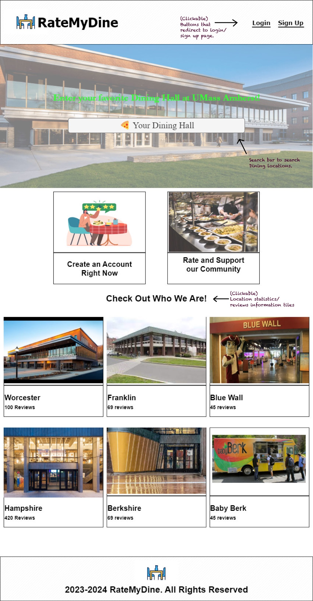
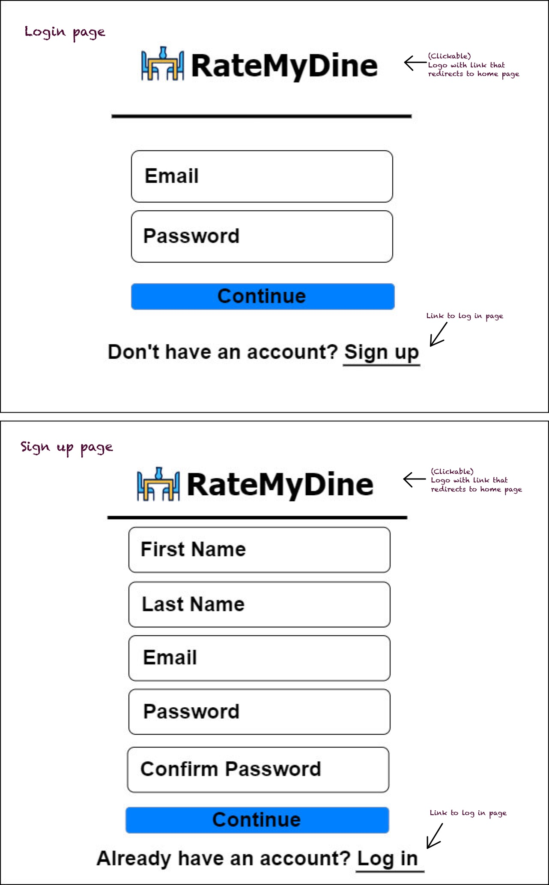
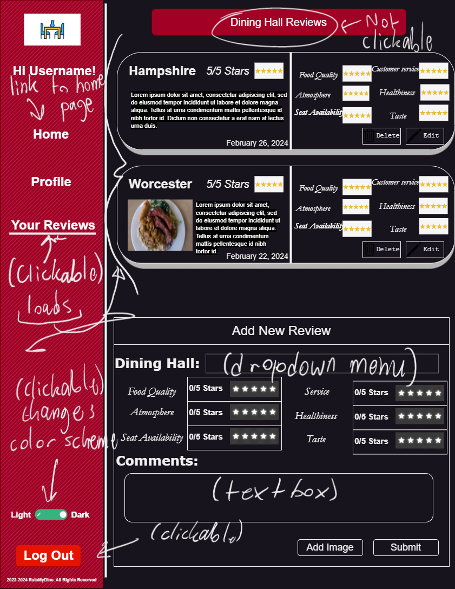
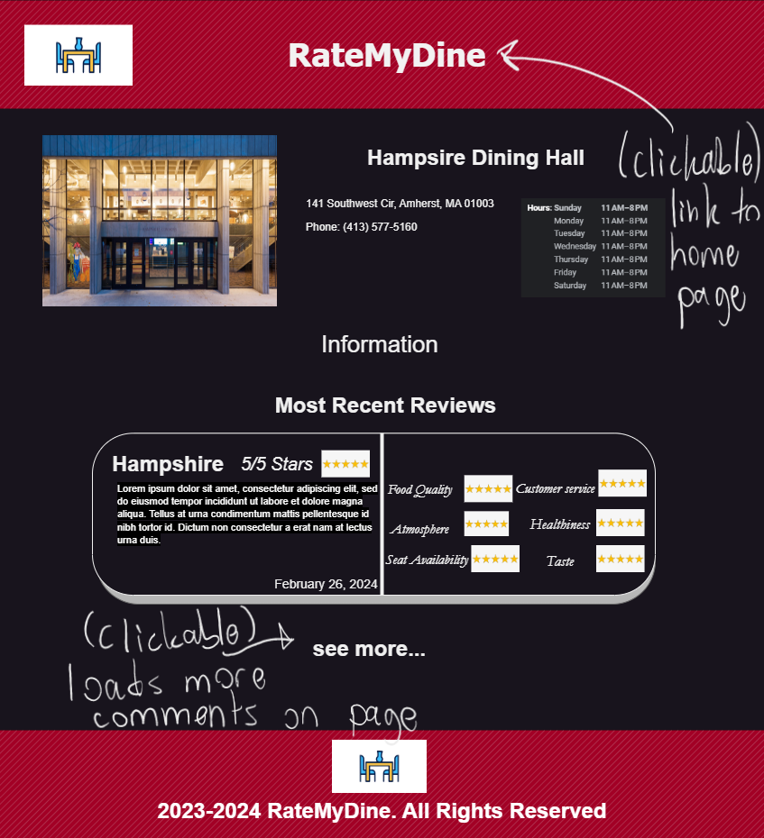

# UI Design

## Wireframe

## Stories

### Story 1

Users will arrive at the home page. This is the page where user can get an overview of the popular dining locations on campus. They can see how many reviews each location has and also click on these info boxes to be redirected to the corresponding location's statistics/reviews, or even search for a location. They also have the ability to login to their account or sign up using the buttons that appear in the upper right corner. 

### Story 2

This is the page that users will arrive at when they click the sign in button. The page will ask for the user to enter their email and password to authenticate to their account, will also be prompted to create an account if they do not already have one. If they click the sign up button, they will be presented with a page where the user enters their name, email, and password to create an account. Similiarly, they will also be presented with a redirection link to the login page if they already have an account. The logo on both the login and sign up pages also allows for the user to click and be redirected back to the homepage.

### Story 3

This is the page that users will arrive at after they create an account or login. The page consists of the two most recent reviews that the user has reviewed, which can be edited or deleted with the edit/delete buttons associated with the review entry. The user will be able to go back to the main page with the home link or the logo, tentative functionality with the Profile button, and go to the landing page of Your Reviews, all by clicking on their respective links. Users also have the ablity to add a new review through a dropdown form that takes in a dining location, some aspect ratings, and comments. Users also can change the appearance of the website with a light/dark mode toggle and log out using the Log Out button. (Tentative) - Users also have the option to append an image to the review if they so choose.

## Story 4

This is the page that users will arrive at when they click on any of the dining hall "tiles" on the main page. It displays the hours that the dining hall is open, their contact information, their physical address, and the current most recent review of that dining hall. In order to return back to the main page, the user needs to click on the "RateMyDine" text at the top of the page. The user can also view more reviews and comments about the dining hall by clicking on the "see more" button just below the most recent comment.

## HTML & CSS Mockup

Reiciendis velit dolorum voluptas earum. Rerum nobis accusantium laudantium minima incidunt. Magnam aut minus minus. Cumque unde voluptatibus soluta molestias perspiciatis aperiam accusantium laborum quo.

Natus est molestias est et autem non in. Laudantium consequatur facilis perferendis. Saepe similique sapiente rem ut. Laudantium natus voluptas delectus molestiae ab omnis quidem. Maxime cumque porro ea deleniti incidunt nihil cupiditate sunt. Nihil eaque porro nemo veritatis.

Ipsam architecto nulla ut dolor dolor sit mollitia deleniti minus. Velit quia iste.

## References

- [Link 1](https://www.ratemyprofessors.com/)
- [Link 2](https://example.com)
- [Link 3](https://example.com)